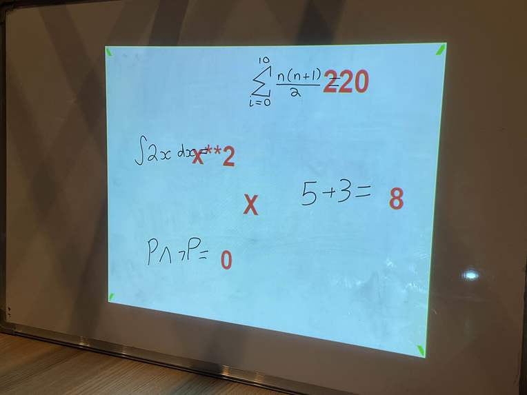
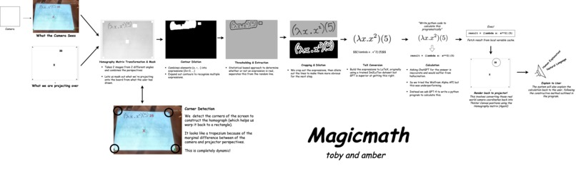

<a id="readme-top"></a>

<!-- PROJECT SHIELDS -->
[![Contributors][contributors-shield]][contributors-url]
[![Forks][forks-shield]][forks-url]
[![Stargazers][stars-shield]][stars-url]
[![Issues][issues-shield]][issues-url]
[![MIT License][license-shield]][license-url]
[![LinkedIn][linkedin-shield]][linkedin-url]

<!-- PROJECT LOGO -->
<br />
<div align="center">
  <a href="https://github.com/aswarbs/magicmath">
    
  </a>

  <h3 align="center">Magicmath</h3>

  <p align="center">
    An open-source, augmented projection system for advanced mathematics.
    <br />
    <a href="https://github.com/aswarbs/magicmath"><strong>Explore the docs »</strong></a>
    <br />
    <br />
    <a href="https://github.com/aswarbs/magicmath">View Demo</a>
    ·
    <a href="https://github.com/aswarbs/magicmath/issues/new?labels=bug&template=bug-report---.md">Report Bug</a>
    ·
    <a href="https://github.com/aswarbs/magicmath/issues/new?labels=enhancement&template=feature-request---.md">Request Feature</a>
  </p>
</div>


<!-- ABOUT THE PROJECT -->
## About Magicmath



Magicmath is a free, open-source alternative to Apple Intelligence™ for mathematics. It goes beyond basic math to handle advanced notations like summations (Σ) and λ-calculus. By combining augmented reality with computer vision, Magicmath transforms how you interact with whiteboards for math and logic, adding features like:

- Parsing complex mathematical expressions.
- Dynamic rendering of solutions in **LaTeX**.
- Explaining solutions with **LLM-powered TTS**.



<p align="right">(<a href="#readme-top">back to top</a>)</p>

---

### Built With

* [![OpenCV][OpenCV-shield]][OpenCV-url]
* [![Python][Python-shield]][Python-url]
* [![Tkinter][Tkinter-shield]][Tkinter-url]

<p align="right">(<a href="#readme-top">back to top</a>)</p>

---

## Getting Started

Follow these steps to set up Magicmath locally.

### Prerequisites

- Install Python 3.x: [Download Python](https://www.python.org/downloads/)
- Install other dependencies:
  ```sh
  pip install -r requirements.txt

## Usage

Magicmath uses a webcam and projector to:

- Parse handwritten math expressions on a whiteboard.
- Solve advanced mathematical problems.
- Display solutions using augmented projection.

For more examples and guides, refer to the documentation.

<p align="right">(<a href="#readme-top">back to top</a>)</p>

---


<!-- LICENSE -->
## License

Distributed under the MIT License. See `LICENSE.txt` for more information.

<p align="right">(<a href="#readme-top">back to top</a>)</p>


<!-- MARKDOWN LINKS & IMAGES -->
<!-- https://www.markdownguide.org/basic-syntax/#reference-style-links -->
[contributors-shield]: https://img.shields.io/github/contributors/aswarbs/magicmath.svg?style=for-the-badge
[contributors-url]: https://github.com/aswarbs/magicmath/graphs/contributors
[forks-shield]: https://img.shields.io/github/forks/aswarbs/magicmath.svg?style=for-the-badge
[forks-url]: https://github.com/aswarbs/magicmath/network/members
[stars-shield]: https://img.shields.io/github/stars/aswarbs/magicmath.svg?style=for-the-badge
[stars-url]: https://github.com/aswarbs/magicmath/stargazers
[issues-shield]: https://img.shields.io/github/issues/aswarbs/magicmath.svg?style=for-the-badge
[issues-url]: https://github.com/aswarbs/magicmath/issues
[license-shield]: https://img.shields.io/github/license/aswarbs/magicmath.svg?style=for-the-badge
[license-url]: https://github.com/aswarbs/magicmath/blob/master/LICENSE.txt
[linkedin-shield]: https://img.shields.io/badge/-LinkedIn-black.svg?style=for-the-badge&logo=linkedin&colorB=555
[linkedin-url]: https://linkedin.com/in/amber-swarbrick-50b963172/
[product-screenshot]: images/screenshot.png
[Next.js]: https://img.shields.io/badge/next.js-000000?style=for-the-badge&logo=nextdotjs&logoColor=white
[Next-url]: https://nextjs.org/
[React.js]: https://img.shields.io/badge/React-20232A?style=for-the-badge&logo=react&logoColor=61DAFB
[React-url]: https://reactjs.org/
[Vue.js]: https://img.shields.io/badge/Vue.js-35495E?style=for-the-badge&logo=vuedotjs&logoColor=4FC08D
[Vue-url]: https://vuejs.org/
[Angular.io]: https://img.shields.io/badge/Angular-DD0031?style=for-the-badge&logo=angular&logoColor=white
[Angular-url]: https://angular.io/
[Svelte.dev]: https://img.shields.io/badge/Svelte-4A4A55?style=for-the-badge&logo=svelte&logoColor=FF3E00
[Svelte-url]: https://svelte.dev/
[Laravel.com]: https://img.shields.io/badge/Laravel-FF2D20?style=for-the-badge&logo=laravel&logoColor=white
[Laravel-url]: https://laravel.com
[Bootstrap.com]: https://img.shields.io/badge/Bootstrap-563D7C?style=for-the-badge&logo=bootstrap&logoColor=white
[Bootstrap-url]: https://getbootstrap.com
[JQuery.com]: https://img.shields.io/badge/jQuery-0769AD?style=for-the-badge&logo=jquery&logoColor=white
[JQuery-url]: https://jquery.com 
[OpenCV-shield]: https://img.shields.io/badge/OpenCV-5C3EE8?style=for-the-badge&logo=opencv&logoColor=white
[OpenCV-url]: https://opencv.org/

[Python-shield]: https://img.shields.io/badge/Python-3776AB?style=for-the-badge&logo=python&logoColor=white
[Python-url]: https://www.python.org/

[Tkinter-shield]: https://img.shields.io/badge/Tkinter-FF6F00?style=for-the-badge&logo=python&logoColor=white
[Tkinter-url]: https://docs.python.org/3/library/tk.html
